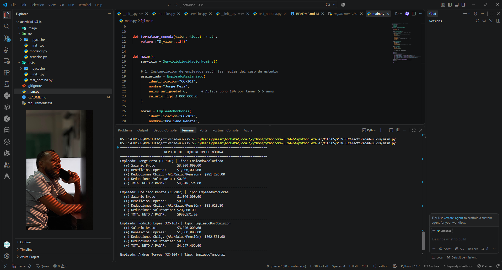

# Sistema de Nómina Orientado a Objetos (SOLID)

**Actividad de Aprendizaje - Unidad 3**  
**Asignatura:** Desarrollo y Pruebas de Software  
**Programa:** Ingeniería de Software  
**Institución:** Universidad de Cartagena  
**Docente:** Ureliano Peñata Hernández  

---

## 👥 Integrantes - CIPA *404 Not Found*

| Integrante | Correo Institucional | Rol Principal en el Proyecto |
| :--- | :--- | :--- |
| **Jorge Enrique Meza Rocha** (`jemezar`) | `jmezar@unicartagena.edu.co` | Integración, CLI/Reporte, Documentación y Arquitectura |
| **Juan Guillermo Hernández Gastelbondo** (`juanguillo125`) | `jhernandezg5@unicartagena.edu.co` | Orquestador Contable, Servicios y Suite de Pruebas Unitarias |
| **Ever Antonio Assia Ibañez** (`AntonioAssia`) | `eassiai@unicartagena.edu.co` | Dominio OOP, Deducciones de Ley y Reglas de Negocio |

---

## 📋 Descripción del Proyecto y Reglas de Negocio

El proyecto consiste en el diseño e implementación de un **Sistema de Nómina Empresarial** modular y robusto bajo el paradigma de **Programación Orientada a Objetos (POO)** y los principios **SOLID**, permitiendo liquidar periódicamente salarios, beneficios corporativos y deducciones para distintos esquemas laborales:

### 1. Tipos de Empleados y Devengos
* **Empleado Asalariado:**
  * Salario fijo mensual garantizado.
  * **Beneficio de Antigüedad:** Bono mensual adicional del 10% del salario fijo si cuenta con más de 5 años en la empresa.
* **Empleado por Horas:**
  * Liquidación por horas laboradas a tarifa base convenida.
  * **Horas Extras:** Jornadas superiores a 40 horas se remuneran con un recargo del **50%** ($1.5 \times$ tarifa normal).
  * No percibe bonos salariales.
* **Empleado por Comisión:**
  * Salario base garantizado más porcentaje de comisión pactado sobre el total de ventas.
  * **Bono de Desempeño Comercial:** Si las ventas del periodo superan los **$20.000.000**, recibe un bono adicional del **3%** sobre el total de ventas.
* **Empleado Temporal:**
  * Salario fijo mensual bajo contrato por tiempo definido.
  * No aplican bonos ni beneficios adicionales.

### 2. Deducciones Obligatorias de Ley
* **Seguro Social y Pensión:** Retención del 4% en Salud y 4% en Pensión (Total 8%) sobre el salario bruto.
* **ARL (Riesgos Laborales):** Tarifa base de ley para Clase I de riesgo (0.522%) o configurable.

### 3. Beneficios Adicionales
* **Empleados Permanentes (Asalariado y Comisión):** Auxilio / Bono de alimentación de **$1.000.000/mes**, cubierto directamente por la empresa.
* **Empleados por Horas:** Si su antigüedad supera 1 año, tienen la facultad opcional de ingresar al **Fondo de Ahorro**, con una deducción voluntaria del **2%** de su salario bruto.

### 4. Validaciones de Integridad y Reglas Contables
* Ningún trabajador puede registrar un salario neto negativo.
* Las horas laboradas no pueden ser inferiores a cero.
* Las ventas de un empleado comisionista no pueden ser menores a $0.
* Identificación, nombres y salarios base deben ser estrictamente válidos.

---

## 🏛️ Aplicación de Principios SOLID

El diseño de la solución garantiza mantenibilidad y extensibilidad:

1. **S - Responsabilidad Única (*Single Responsibility Principle*):**
   * Cada clase de empleado (`EmpleadoAsalariado`, `EmpleadoPorHoras`, etc.) encapsula únicamente las reglas matemáticas y de negocio de su modalidad laboral.
   * `ServicioLiquidacionNomina` se responsabiliza exclusivamente de la liquidación masiva, consolidación y balance contable de la empresa.

2. **O - Abierto/Cerrado (*Open/Closed Principle*):**
   * El sistema está abierto a la extensión y cerrado a la modificación. Para incorporar un nuevo perfil de contratación (ej. *Empleado por Prestación de Servicios* o *Practicante SENA*), solo se debe heredar de `Empleado` e implementar `calcular_salario_bruto()`, sin alterar las clases existentes.

3. **L - Sustitución de Liskov (*Liskov Substitution Principle*):**
   * Cualquier subtipo de `Empleado` puede sustituir a la clase base en cualquier contexto sin alterar la consistencia de los cálculos ni romper contratos pre/post-condición (`calcular_salario_neto()`).

4. **I - Segregación de Interfaces (*Interface Segregation Principle*):**
   * Se separan claramente los métodos de ingresos directos (`calcular_salario_bruto()`), beneficios opcionales corporativos (`calcular_beneficios_empresa()`) y deducciones voluntarias (`calcular_deducciones_voluntarias()`), evitando forzar a las subclases a implementar métodos innecesarios.

5. **D - Inversión de Dependencias (*Dependency Inversion Principle*):**
   * `ServicioLiquidacionNomina` depende de la abstracción `Empleado`, no de implementaciones concretas.

---

## 🛠️ Metodología de Desarrollo y Control de Versiones

El equipo implementó una combinación de **Scrum** y **Extreme Programming (XP)**:

* **Gestión de Historias de Usuario e Iteraciones (Scrum):**
  * La actividad se descompuso en historias de usuario correspondientes a cada perfil contractual, motor de deducciones y módulo de presentación.
* **Prácticas XP Adoptadas:**
  * **Test-Driven Development (TDD) / Pruebas Continuas:** Desarrollo de suite automatizada con `unittest` con cobertura sobre casos nominales y casos borde.
  * **Refactorización y Código Limpio:** Eliminación de números mágicos mediante constantes con nombre semántico (`LIMITE_HORAS_ORDINARIAS`, `UMBRAL_VENTAS_BONO`), tipado estático (*Type Hints*) y comentarios técnicos según PEP-8.
  * **Revisión de Código y Colaboración:** Simulación y trazabilidad de commits en equipo distribuyendo las contribuciones entre los integrantes en GitHub.

---

## 🚀 Estructura del Repositorio

```text
actividad-u3-is/
├── src/
│   ├── __init__.py
│   ├── modelos.py          # Jerarquía OOP de Empleados, constantes y validaciones
│   └── servicios.py        # Servicio orquestador y balance consolidado
├── tests/
│   ├── __init__.py
│   └── test_nomina.py      # 18 pruebas unitarias automatizadas con unittest
├── image/
│   └── portada.png         # Recursos visuales del proyecto
├── main.py                 # Punto de entrada y reporte en consola
├── requirements.txt        # Dependencias opcionales
├── .gitignore              # Exclusiones de Git
└── README.md               # Documentación general de la actividad
```

---

## 🧪 Ejecución de Pruebas Unitarias

Para ejecutar la suite automatizada de pruebas con el motor estándar de Python:

```bash
python -m unittest discover tests
```

Salida esperada:
```text
..................
----------------------------------------------------------------------
Ran 18 tests in 0.000s

OK
```

---

## 💻 Ejecución del Sistema

Para ejecutar la demostración completa del sistema de nómina y observar el balance consolidado:

```bash
python main.py
```

---


